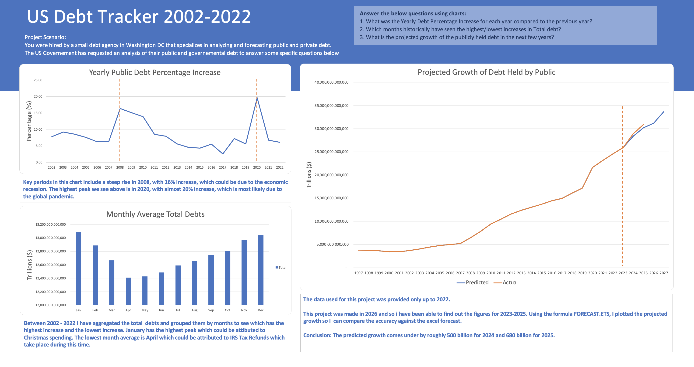

# US Debt Tracker | Excel

An interactive US Debt Tracker built in Excel, showcasing the intersection of data analysis and visual storytelling. This project, completed through Analyst Builder, documents the lifecycle of U.S. National Debt via data cleaning, trend analysis, and dynamic reporting. It serves as a practical application of my CompTIA Data+ skills, focusing on making high-level economic data accessible and actionable.

### 💡 Key Insights & Findings
* 16% increase of public debt in 2008. Could be due to **economic recession**.  

* Almost 20% increase of public debt in 2020. Most likely due to the global pandemic.

* Monthly average of total debt chart shows that January has the highest average total debt. This could be attributed to Christmas/Thanksgiving spending in December with statements coming in January.

* The lowest month average is April which could be attributed to IRS Tax Refunds which take place during this time.  

### 📁 Project Questions:
1. What was the Yearly Debt Percentage Increase for each year compared to the previous year? (answered in graph 1 - top left)
2. Which months historically have seen the highest/lowest increases in Total debt? (answered in graph 2 - bottom left)
3. What is the projected growth of the publicly held debt in the next few years?

**Data Dictionary:**
Data covered the years 1993 to early 2023. 
Debt Held by the Public - This is the portion of the US public debt that is held by individuals, corporations, foreign governments, and other entities outside of the US government.
Intragovernmental Holdings - This is the portion of the US public debt that is held by other US government agencies.
Total Public Debt Outstanding - Debt Held by  the Public PLUS Intragovernmental Holdings.

🛠️ Key Technical Skills includes:  
<ins>Data Cleaning</ins> The data set included dates as columns rather than rows and so the data need to be transposed.

<ins>Pivot Tables</ins> Creating pivot tables to understand the figures using aggregations such as averages and sums.

<ins>Data Visualisation</ins> To answer the questions for the project I created line charts and a column chart to convey the public debt in the US. 

### 🧹 Phase 1: Data appropriation
The raw data had the years in columns whereas I would need them as rows to create a useable pivot table. This was an easy fix using transpose. 

I also formatted the figures from scientific notation to numbers with commas and reduced to no  decimal points. It's easier to read the figures as we're working with numbers in the trilions. 

There were a few blank rows showing up when i looked at the filters and so i deleted the rows that contained no information. The data shows the years from 1993 but it contained no data for 'Debt Held by the Public' and 'Intragovernmetal Holdings' columns until around 2000. There was however, information in the 'Total Public Debt Outstanding' column from 1993 which i could use if needed. 

### 📊 Phase 2: Answering project questions
With the data transposed I could begin working on how to work with the data to answer the project questions.

**1. What was the Yearly Debt Percentage Increase for each year compared to the previous year?** 
I began filtering the dates so thatIwas only left with the last date of the year. (e.g. 31/12/2001).  This allow me to calculate the percent increase based on the previous year. The calculation i used was **VALUE IN 2022 - VALUE IN 2021 / VALUE IN 2021 * 100**. With this percentage,I simply take the year and percentage column  and turn  this into my first chart.  Key things i can see first is the spikes in 2008 and 2020 probably  due to the economic recession and global pandemic respectively.

**2. Which months historically have seen the highest/lowest increases in Total debt?**
Using the year column and the 'Total Public Debt Outstanding' column, I created a pivot table. I used the aggregated Month information for rows and Average of Total Public Debt Outstanding for the values. As the questions asks about historical reference, I have used the entire data set from 1993 to 2023. Note: 2023 data was represenatative of the entire year. Data provided was only given up to 15th Feb 2023. I then created a column chart using the pivot table to visualise the  data. Key things I can see first is that Jan had the highest increase in total debt and the lowest increase was April.

**3. What is the projected growth of the publicly held debt in the next few years?**
Again, I've chosen to use a pivot table using my cleaned data. Columns used were Date and Debt Held by the Public column. Once created, I can see there is no data from 1993 - 1996 (inclusive) so i have removed them. I then copy and paste the values from the pivot table to another area on my worksheet. I add the years 2024, 2025, 2026 and 2027 to the dates column. Utilising the **FORECAST.ETS** I fill in the values for the aforementioned dates. 

The time of working on this project is 2026. I have access to the information for the actual values for 2024 and 2025. I add these values to my chart asit would be interesting to see how accurate the figures are comparing predicted vs actual. 

Interestingly, the 2024 prediction by excel was only 1.78% under the actual figure (circa $500 billion). the  2025 prediction was 2.25% under the actual figure (circa $680 Billion).
